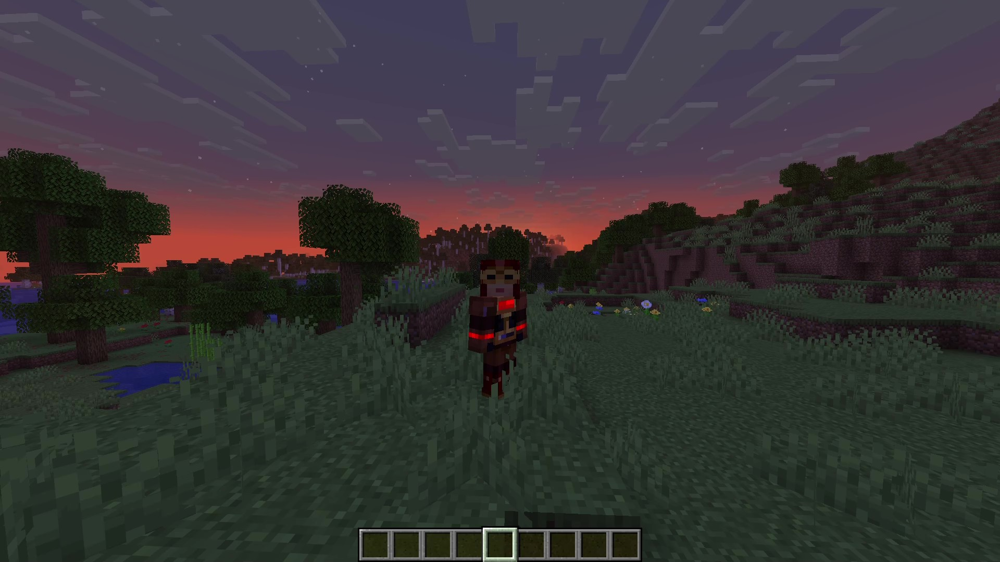
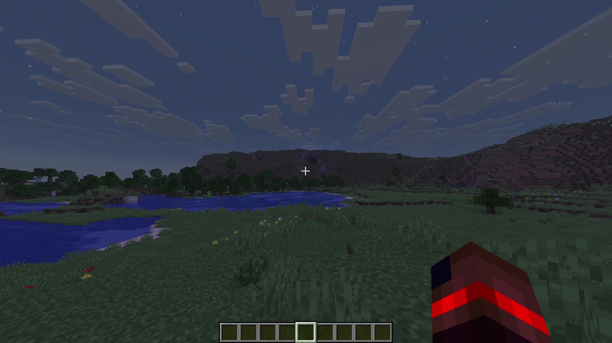
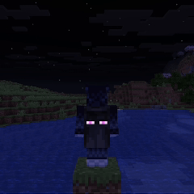
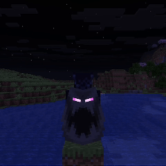
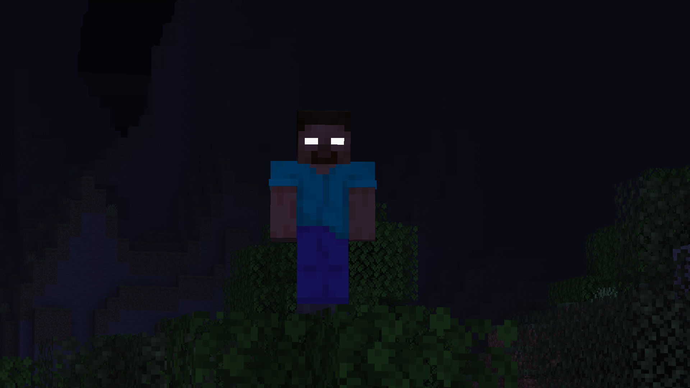

# Skinmatics
A Versatile yet minimal player customization mod.

---

## About
Want custom animated skins? emissive (glowing) skins? and maybe even animated and reactive eyes?

Skinmatics gives you just that.

## Features

- Skin

  
  
- Cape
  
  
- Elytra

  
  > *Yes, they looked goofy since the wings are mirrored.*
- Eyes

  
  

Note: The mod does not come with pre-made textures, players must create their own textures to use these features.

## How To Use
### In-Game
Currently, the editor for the mod is still a work-in-progress, and only serves as a refresh screen for now.

To open it, open `Options` > `Skin Customizations` > `Skinmatics` or from Mod Menu.

### Manual
From the in-game editor, it tells you the current profile you're using. You can change your profile in the config (`config/skinmatics/config.json`).
Textures are stored in `config/skinmatics/textures`.

<details>
<summary>Profile Content</summary>

```json
{
  "enabled": true, // Whether the profile is enabled or not
  "maxTicks": 0, // The maximum amount of ticks your skin can tick before looping back to 0
  "strongerEmissiveGlow": false, // Change your glows to not be affected by lightning
  "enableCustomSkin": false, // Change your skin
  "enableEmissiveSkin": false, // Add glow to your skin
  "showCape": true, // Force show cape
  "enableCustomCape": false, // Change your cape texture
  "enableEmissiveCape": false, // Add glow to your cape
  "enableCustomElytra": false, // Change your elytra texture (use cape texture if false)
  "enableEmissiveElytra": false, // Add glow to your elytra (use emissive cape texture if false)
  "enableEyes": false, // Enable eyes
  "blinkingChancePerTick": 48, // Blinking chance per tick
  "holdBlinkingForTicks": 4, // How long the eye closed when blinking
  "enableEmissiveRightEye": false, // Add glow to your right eye
  "enableEmissiveLeftEye": false, // Add glow to your left eye
  "enableOverlays": false, // Additional eye features in-case your eye have emissive enabled. Useful for eyebrows
  "skin": { // Example
    "some_skin_texture": [0, 10] // Texture is relative to `config/skinmatics/textures/...`. In this case, the texture is `config/skinmatics/textures/some_skin_texture.png`
    "minecraft:some_other_skin_texture": [5] // Texture is relative to a mod or minecraft under `assets/textures/...` resources, or any defined texture in Minecraft's texture manager
    // Second field describe their time to change the texture
    // In this case we use `some_skin_texture` when we start (tick 0)
    // then change `minecraft:some_other_skin_texture` at tick 5
    // then change it back to `some_skin_texture` at tick 10
  },
  // All these `{}` fields are the same as `skin`. Leave empty to not render any during the state
  "emissiveSkin": {},
  "cape": {},
  "emissiveCape": {},
  "elytra": {},
  "emissiveElytra": {},
  "eyes": {
    "left": { // Left eye
      // Directions + closed
      "closed": {},
      "front": {},
      "up": {},
      "down": {},
      "right": {},
      "rightUp": {},
      "rightDown": {},
      "left": {},
      "leftUp": {},
      "leftDown": {}
    },
    "right": { // Right eye
      // Look directions + closed
      "closed": {},
      "front": {},
      "up": {},
      "down": {},
      "right": {},
      "rightUp": {},
      "rightDown": {},
      "left": {},
      "leftUp": {},
      "leftDown": {}
    }
  },
  "overlays": {
    "left": { // Synced to left eye
      "closed": {},
      "front": {},
      "up": {},
      "down": {},
      "right": {},
      "rightUp": {},
      "rightDown": {},
      "left": {},
      "leftUp": {},
      "leftDown": {}
    },
    "right": { // Synced to right eye
      "closed": {},
      "front": {},
      "up": {},
      "down": {},
      "right": {},
      "rightUp": {},
      "rightDown": {},
      "left": {},
      "leftUp": {},
      "leftDown": {}
    }
  }
}
```
</details>

---
